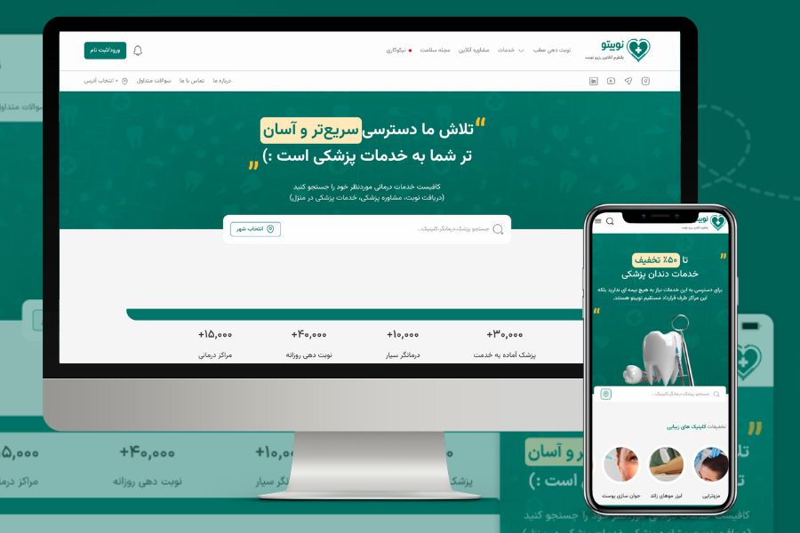

<div align="center">
  
  
  # 🏥 Nobito - Healthcare Platform
  
  [](https://nobito-demo.vercel.app/)
  [](https://nextjs.org/)
  [](https://www.typescriptlang.org/)
  [](https://web.dev/progressive-web-apps/)
  
  **A modern, feature-rich healthcare platform built with Next.js 15, offering seamless doctor appointments, medical services, and comprehensive patient care.**
  
  [Live Demo](https://nobito-demo.vercel.app/) • [Features](#-features) • [Tech Stack](#-tech-stack) • [Getting Started](#-getting-started)
</div>

---

## ✨ Features

### 🚀 Core Capabilities
- **Progressive Web App (PWA)** - Install and use offline with full app-like experience
- **Doctor Appointments** - Browse, filter, and book appointments with healthcare professionals
- **Medical Services at Home** - Request in-home medical care and consultations
- **Beauty & Wellness Services** - Access to beauty clinics and wellness treatments
- **Online Consultations** - Virtual doctor visits and remote healthcare
- **Medical Shop** - Browse and purchase medical equipment and supplies
- **Patient Dashboard** - Manage appointments, medical files, and health records
- **Weblog & Resources** - Health articles and medical information

### 💎 Technical Highlights
- **Server-Side Rendering (SSR)** - Optimized performance with Next.js 15
- **Responsive Design** - Seamless experience across all devices
- **Modern UI/UX** - Built with Radix UI and Tailwind CSS
- **State Management** - Efficient state handling with Zustand
- **Form Validation** - Robust forms with React Hook Form
- **Advanced Carousel** - Smooth image galleries with Embla Carousel
- **Date Picker** - Persian/Gregorian calendar support
- **Offline Support** - Full PWA capabilities with service workers

### 🎨 User Experience
- Fast page loads and smooth transitions
- Intuitive navigation and search functionality
- Real-time appointment availability
- Patient feedback and rating system
- Multi-language support (RTL/LTR)
- Accessible and inclusive design

---

## 🛠 Tech Stack

### Frontend
- **Framework:** Next.js 15.2 (App Router)
- **Language:** TypeScript 5
- **Styling:** Tailwind CSS 4.0
- **UI Components:** Radix UI
- **State Management:** Zustand
- **Forms:** React Hook Form
- **Carousel:** Embla Carousel
- **PWA:** @ducanh2912/next-pwa

### Development
- **Package Manager:** Yarn 4.7
- **Linting:** ESLint 9
- **Build Tool:** Webpack 5

---

## 🚀 Getting Started

### Prerequisites
- Node.js 20+ 
- Yarn 4.7+

### Installation

1. **Clone the repository**
```bash
git clone https://github.com/yourusername/nobito-demo.git
cd nobito-demo
```

2. **Install dependencies**
```bash
yarn install
```

3. **Run development server**
```bash
yarn dev
```

4. **Open your browser**
```
http://localhost:3000
```

### Build for Production

```bash
# Create optimized production build
yarn build

# Start production server
yarn start
```

### PWA Features
The app automatically generates service workers and manifest files. After building, you can:
- Install the app on mobile devices
- Use offline functionality
- Receive push notifications (if configured)

---

## 📁 Project Structure

```
nobito-demo/
├── app/                    # Next.js App Router
│   ├── (website)/         # Main website routes
│   │   ├── doctors/       # Doctor listings & profiles
│   │   ├── online-appointments/
│   │   ├── medical-services-at-home/
│   │   ├── beauty-services/
│   │   ├── shop/          # Medical equipment shop
│   │   ├── user-dashboard/
│   │   └── weblog/
│   └── sign-in/           # Authentication
├── components/            # React components
│   └── website/          # Website-specific components
├── assets/               # Fonts & styles
├── lib/                  # Utilities & store
├── public/               # Static assets & PWA files
└── utils/                # Helper functions
```

---

## 🌟 Key Pages

| Page | Description | Route |
|------|-------------|-------|
| **Home** | Landing page with services overview | `/` |
| **Doctors** | Browse and filter healthcare professionals | `/doctors` |
| **Appointments** | Book online consultations | `/online-appointments` |
| **Home Services** | Request in-home medical care | `/medical-services-at-home` |
| **Beauty Services** | Beauty clinics and treatments | `/beauty-services` |
| **Shop** | Medical equipment marketplace | `/shop` |
| **Dashboard** | Patient portal and records | `/user-dashboard` |
| **Weblog** | Health articles and resources | `/weblog` |

---

## 🎯 Performance

- ⚡ **Lighthouse Score:** 95+ (Performance, Accessibility, Best Practices, SEO)
- 📱 **Mobile-First:** Optimized for mobile devices
- 🔄 **PWA Ready:** Installable with offline support
- 🚀 **Fast Load Times:** Server-side rendering and code splitting
- ♿ **Accessible:** WCAG 2.1 compliant

---

## 🤝 Contributing

Contributions are welcome! Please feel free to submit a Pull Request.

---

## 📄 License

This project is licensed under the MIT License.

---

## 🔗 Links

- **Live Demo:** [https://nobito-demo.vercel.app/](https://nobito-demo.vercel.app/)
- **Documentation:** [Next.js Docs](https://nextjs.org/docs)
- **Report Issues:** [GitHub Issues](https://github.com/yourusername/nobito-demo/issues)

---

<div align="center">
  <p>Built with ❤️ using Next.js and modern web technologies</p>
  <p>© 2024 Nobito Healthcare Platform</p>
</div>
